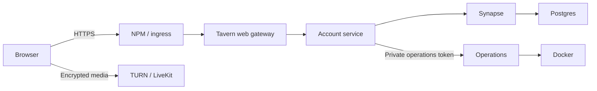

# Tavern 0.4 architecture

Tavern keeps Synapse as the identity, room membership, event storage and realtime authority. The browser uses the Matrix SDK's Rust encryption implementation. A small account service adds the product's account and administrator workflows; it does not receive message decryption keys.

## Request boundaries

The managed account service issues Secure, HttpOnly, SameSite cookies. Matrix access tokens are encrypted at rest in its SQLite store and never returned to JavaScript. A browser uses an unprivileged device identifier in place of a Matrix bearer token. The gateway checks the identifier against the cookie session before forwarding an authenticated Matrix request. An old tab therefore cannot silently use a different account after the shared cookie changes.

Native password login, recovery and media upload paths are unavailable through the public gateway in managed mode. This prevents callers from bypassing MFA and byte quotas. Synapse is reachable only on the internal Docker network. A separately hosted static client retains the legacy Matrix login path and has a different session storage boundary.

## Durable state

| Store | Contents |
|---|---|
| Postgres and Synapse media | Matrix identities, events, room state, original encrypted uploads and thumbnails |
| Account SQLite and encryption key | Managed sessions, email verification, MFA state, settings, invitations, reports, audit entries and upload reservations |
| Browser crypto IndexedDB | Matrix device keys and decrypted-session state managed by the official SDK |
| Browser search IndexedDB | AES-GCM encrypted search documents, HMAC search postings and nonextractable device-local keys |
| Matrix account data | Personal preferences, saved event references, contacts' privacy settings where applicable, navigation and folders |
| Matrix room and Space state | Channel metadata, categories, branding, per-server identities, roles and moderation restrictions |
| Operations volume | Backup archives, operation jobs and scheduler settings |
| Optional integration volumes | Bot identity, verified-device allowlists and encrypted delivery queue |

Backups must include the account encryption key with its database. Losing a browser's encryption keys requires the user's Matrix recovery key or an encrypted key export; an administrator password reset does not recover message keys.

## Permission enforcement

Native Matrix membership and power levels remain an upper bound on access. The Synapse third-party event module additionally validates reciprocal parent/child relationships, per-server role hierarchy, explicit capabilities, channel archives, read-only posting, timeouts and slow mode. Frontend visibility uses corresponding helpers, but server checks determine whether a mutation succeeds.

Encrypted bodies cannot be classified into text, images or particular mentions by the homeserver. Enforceable policies consequently operate on room access, encrypted event transmission, byte limits, visible state and call membership. The UI must not present an unenforced content inspection toggle.

## Operations isolation

The optional operations container alone has access to the Docker socket. It accepts a fixed set of operations scoped to the configured Compose project and Tavern management labels. The account service authenticates administrators and forwards requests using a separate private token.

Backups pause relevant writers and capture a consistent database/configuration set. Restore creates isolated stopped volumes for validation; switching production storage is a separate documented procedure. Application updates stay within the installed major/minor release line, take a backup, perform health checks and restore prior application containers on failure. Synapse/Postgres migration is an explicit deployment operation.

## Runtime and validation

The initial authentication shell defers Matrix crypto, the community workspace, administrative tools and calling assets. Message DOM rendering is virtualized. Profile media requests share a bounded object-URL cache. Matrix sync and server-sent events drive updates; history indexing processes small batches without adding all historical events to the live room timeline.

Unit tests cover authentication and authorization failures, concurrency, encrypted storage, roles, uploads and backup boundaries. Browser tests exercise real IndexedDB/WebCrypto and UI flows with controlled upstream fixtures. Docker CI starts a clean canonical stack, validates persistence across recreation and exercises backup/isolated restoration. Live Gmail delivery, two independent encrypted clients and NAT-dependent media still require the operator's environment.
